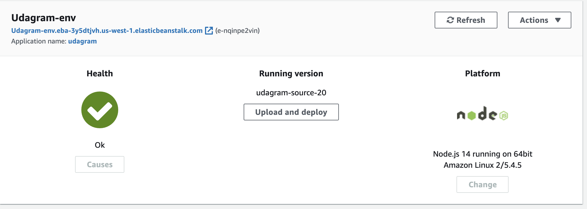

# Udagram

Udagram is an application that allows the user to login and post photos and captions. The application can be found at:

[http://udagram-frontend-skinner.s3-website-us-west-1.amazonaws.com]

See additional documentation in the documentation folder.

## Configuration Screenshots

### ElasticBeanstalk Environment

### S3 Frontend

(./documentation/images/S3Frontend.png)

### S3 Images

(./documentation/images/S3Images.png)

### Infrastructure Diagram

(./documentation/images/InfrastructureDiagram.png)

### Pipeline Diagram

(./documentation/images/PipelineDiagram.png)

## Built With

- [Angular](https://angular.io/) - Single Page Application Framework
- [Node](https://nodejs.org) - Javascript Runtime
- [Express](https://expressjs.com/) - Javascript API Framework

## License

[License](LICENSE.txt)
